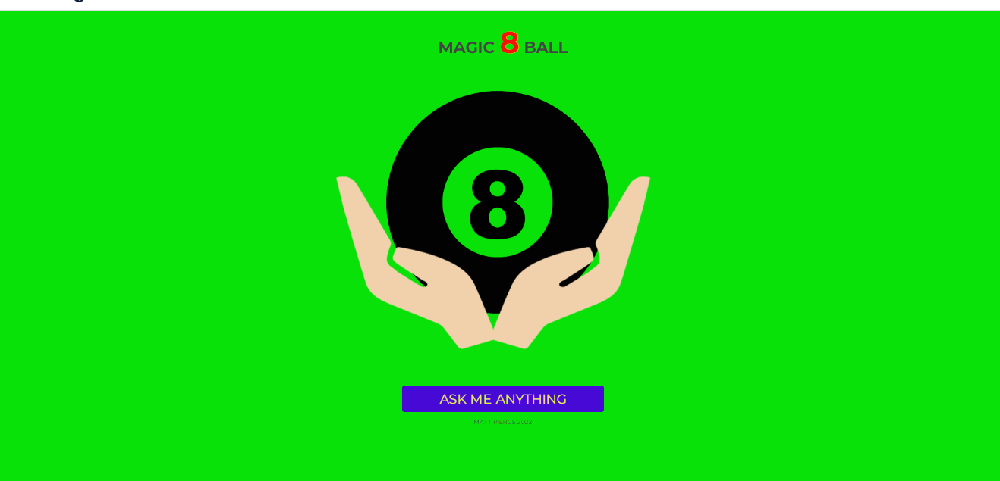
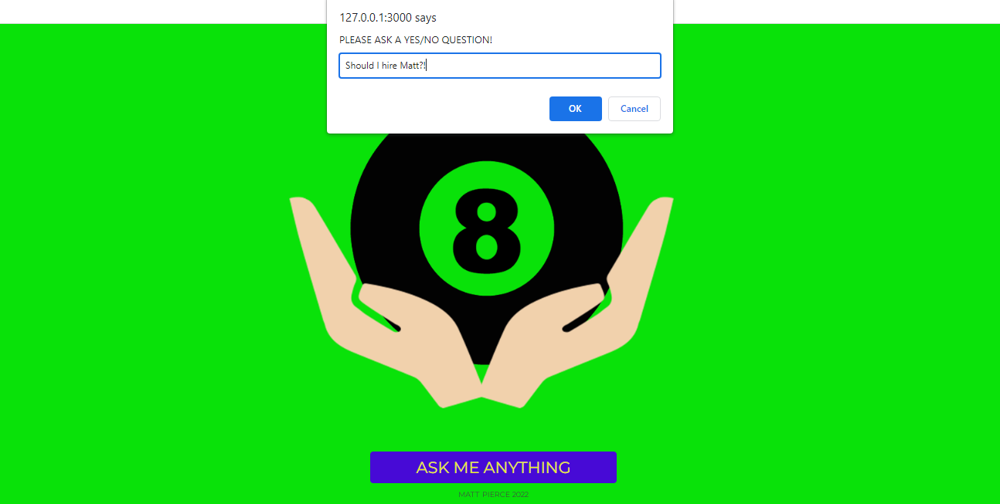
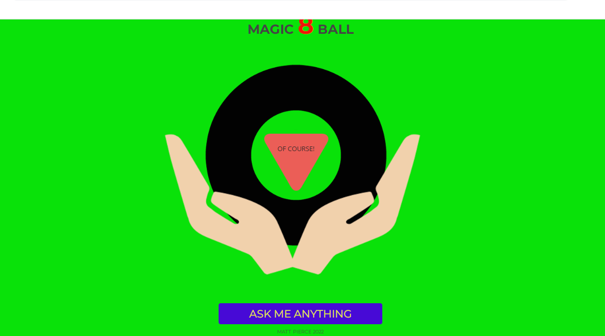

<h1>Magic 8 Ball Project</h1>

<h2>Description</h2>
Project consists of JavaScript Functions, and Event Listeners. You press the button to enter a question, and then hit get response. The program will use a shake effect to reveal the answer! 
Make sure to ask it something fun like "Should I hire Matt?".
 

<h2>Languages and Utilities Used</h2>

- <b>JavaScript, CSS, HTML</b> 
- <b>GitHub, Images</b>

<h2>Environments Used </h2>

- <b>Windows 10</b> (21H2)

<h2>Program walk-through:</h2>

Home Page:  
   

 
 
Click Ask Me Anything and Input Question.   
   

 
 
See What "Shakes" Out!  
   

 
 

